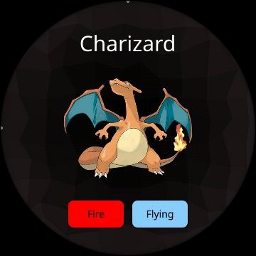

# AsteroidOS Pokédex

This project is a Pokédex designed specifically for AsteroidOS, a versatile open-source operating system designed for smartwatches.

## Overview

The Pokédex app uses the [PokeAPI](https://pokeapi.co/) to fetch comprehensive Pokémon data and display it seamlessly on your AsteroidOS-powered smartwatch. 

### AsteroidOS
AsteroidOS is an open-source operating system built for smartwatches, offering a lightweight and customizable experience. It boasts compatibility with various smartwatch models and provides a platform for developers to create innovative apps tailored for wearable devices.

### Features
- **View Generations**: Explore all Pokémon generations.
- **Generation-based Pokémon**: Browse Pokémon based on their respective generations.
- **Pokémon Types**: Access information about different types of Pokémon.

## Screenshots

## Building the App

To build and deploy the app to your smartwatch, follow these steps:

**WARNING: Before proceeding, ensure SSH address is correctly set.**

1. Run the [Go script](init_app.sh) to generate the database and download the images
2. Build and push the app with [this script](push.sh) 

## Open API

The project using the [PokeAPI](https://pokeapi.co/) for fetching data. 